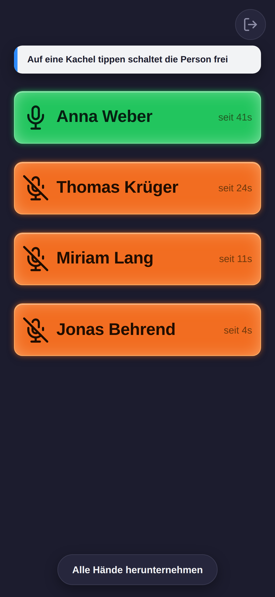
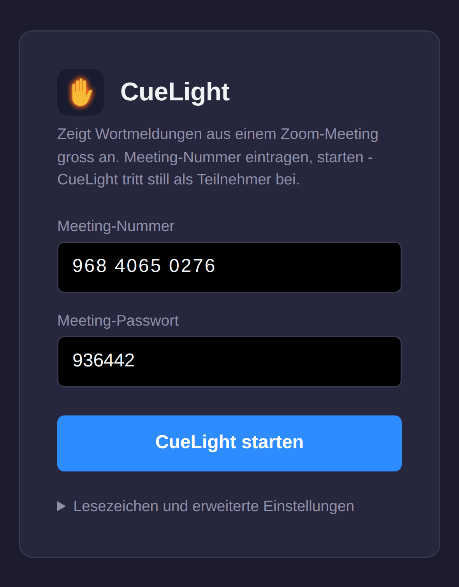

<p align="center">
  
</p>

# CueLight für Zoom

[](https://github.com/derbredi/cuelight/actions/workflows/publish.yml)

**Wortmeldungen aus einem Zoom-Meeting, groß genug, um sie aus dem
Augenwinkel zu sehen.**

Wer vor Publikum spricht und nebenbei Zuhörer aus Zoom dazunehmen will,
hat ein Problem: Das kleine gelbe Handzeichen in der Teilnehmerliste sieht
man nur, wenn man direkt hinschaut. CueLight zeigt stattdessen auf einem
Tablet oder Bildschirm jede gehobene Hand als große, blinkende Kachel mit
dem Namen – auffällig genug, dass man sie mitten im Satz bemerkt.

Ein Tipp auf eine Kachel schaltet die Person frei, sodass sie sofort
sprechen kann.

<p align="center">
  
  
</p>

## Was du brauchst

- **Einen Rechner mit Docker**, der während der Veranstaltung läuft. Ein
  Raspberry Pi oder ein NAS reicht völlig.
- **Ein Zoom-Konto**, unter dem die Meetings stattfinden.
- **Ein Anzeigegerät** mit einem halbwegs aktuellen Browser: Tablet, Laptop
  oder ein Bildschirm am Rechner. CueLight benutzt Zooms Meeting SDK; Zoom
  empfiehlt dafür die aktuelle Browser-Version und zwei vorherige. Ältere
  Geräte sind einen Versuch wert, statt sie von vornherein auszuschließen –
  der schnellste Test steht unten unter „Wenn etwas nicht klappt".

CueLight tritt dem Meeting als eigener, stummer Teilnehmer bei. Es braucht
keinen Zugriff auf den Rechner, der das Meeting hostet.

## Einrichten

### 1. Zoom-App anlegen

Einmalig, kostenlos, dauert fünf Minuten. Melde dich dafür mit dem
Zoom-Konto an, unter dem die Meetings später laufen – CueLight kann nur
Meetings dieses Kontos beitreten.

1. Auf [marketplace.zoom.us](https://marketplace.zoom.us) anmelden.
2. **Develop → Build App → General App** anlegen.
3. Unter **Features → Embed** das **Meeting SDK** einschalten.
4. Unter **Scopes** den Eintrag `user:read:token` hinzufügen.
5. Als **Redirect-URL** die Adresse eintragen, unter der CueLight später
   erreichbar ist, mit `/oauth/callback` am Ende:
   `https://deine-domain.de/oauth/callback` – oder im Heimnetz
   `http://192.168.1.50:4000/oauth/callback` mit der IP deines Servers.
6. Unter **App Credentials** stehen **Client ID** und **Client Secret**.
   Diese beiden Werte brauchst du gleich.

Die App muss nicht veröffentlicht werden.

### 2. CueLight starten

```bash
mkdir cuelight && cd cuelight
curl -O https://raw.githubusercontent.com/derbredi/cuelight/main/docker-compose.yml
nano docker-compose.yml   # Client ID und Client Secret eintragen
docker compose up -d
```

Mit **Portainer** geht es genauso: *Stacks → Add stack*, den Inhalt der
`docker-compose.yml` einfügen, die beiden Werte eintragen, *Deploy*.

Mehr als diese zwei Werte gibt es nicht einzustellen. Ob es läuft, zeigt
`docker compose logs -f`.

### 3. Loslegen

Öffne auf dem Anzeigegerät `http://IP-DES-SERVERS:4000` oder deine Domain,
trage die Meeting-Nummer ein und tippe auf **CueLight starten**.

Beim allerersten Mal erscheint ein blauer Knopf, der dich zu Zoom schickt:
Dort meldest du dich mit dem Konto an, das die Meetings hostet, und gibst
CueLight einmal frei. Das gilt danach dauerhaft.

## Bedienen

- **Kachel antippen** schaltet die Person frei. Dafür braucht CueLight im
  Meeting Host- oder Co-Host-Rechte – gib sie ihm in der
  Zoom-Teilnehmerliste wie jedem anderen auch.
- **Alle Hände herunternehmen** erscheint unter der letzten Kachel.
- **Verlassen** ist der Knopf oben rechts. Danach bleibt CueLight so lange
  im Formular stehen, bis du wieder selbst startest.
- Meeting-Nummer und Passwort merkt sich CueLight auf dem Gerät. Legst du
  die Seite auf den Startbildschirm, ist sie beim nächsten Antippen sofort
  wieder im Meeting.
- Quer gehaltene Geräte zeigen die Meldungen automatisch in mehreren
  Spalten.

## Aus dem Internet erreichbar? Dann absichern

Im Heimnetz kannst du das überspringen. Sobald CueLight aber unter einer
öffentlichen Adresse läuft, sollte nicht jeder hineinkommen – es stellt
Beitritts-Token für dein Zoom-Konto aus.

**Der einfache Weg:** Trag in der `docker-compose.yml` bei
`CUELIGHT_PASSWORD` ein Passwort ein und starte den Container neu. Beim
ersten Aufruf fragt CueLight einmal danach und merkt sich die Anmeldung
ein Jahr lang.

**Hast du schon eine Zugriffskontrolle** – Cloudflare Access, einen
Reverse-Proxy mit Passwortschutz oder ein VPN –, dann lass
`CUELIGHT_PASSWORD` leer. Zweimal anmelden muss sich niemand.

## Betrieb

| Aufgabe | Befehl |
|---|---|
| Aktualisieren | `docker compose pull && docker compose up -d` |
| Stoppen | `docker compose down` |
| Protokoll ansehen | `docker compose logs -f` |

Nach einem Neustart des Servers startet CueLight von selbst wieder mit.

## Wenn etwas nicht klappt

**Der Beitritt schlägt fehl.** Prüfe zuerst, ob das Meeting zu demselben
Zoom-Konto gehört, unter dem du die App angelegt hast. Meetings fremder
Konten lässt Zoom nicht zu.

**Auf einem Gerät passiert gar nichts.** Öffne dort `zoom.us/wc/join` und
tritt einem Meeting bei – das benutzt dieselbe Technik wie CueLight.
Klappt das nicht, ist das Gerät zu alt und CueLight kann daran nichts
ändern. Klappt es dagegen (auch wenn Zoom eine Browser-Aktualisierung
anmahnt), liegt es nicht am Gerät: dann bitte die Seite mit `?debug=1`
öffnen und ein Issue mit dem aufmachen, was in der Browser-Konsole steht.

**Freischalten funktioniert nicht.** Dann hat CueLight im Meeting keine
Host- oder Co-Host-Rechte.

**Gehobene Hände tauchen nicht auf.** Zoom liefert das Handzeichen je nach
Kontotyp unterschiedlich. Öffne die Seite mit `?debug=1` am Ende der
Adresse, dann schreibt CueLight die Rohdaten der Teilnehmerliste in die
Browser-Konsole (F12). Bitte öffne damit ein Issue – dann lässt sich die
Erkennung ergänzen.

**Fehlersuche auf einem Tablet.** `?debug=1` zeigt Fehlermeldungen
zusätzlich unten auf dem Bildschirm an – auch nicht ladbare Dateien und
Fehler, die schon beim Start auftreten. So kommst du an eine brauchbare
Meldung, ohne das Gerät an einen Rechner anschließen zu müssen.

**Anderes Zoom-Konto nötig?** Zoom-Apps lassen sich nicht zwischen Konten
umziehen. Leg im neuen Konto eine App an (Schritt 1), trage die neuen
Zugangsdaten ein, lösche `data/zoom-oauth-tokens.json` und starte den
Container neu.

## Mitmachen

Fehler gefunden oder eine Idee? Gerne ein Issue oder einen Pull Request
öffnen. Sicherheitslücken bitte nicht öffentlich, sondern wie in
[SECURITY.md](SECURITY.md) beschrieben melden.

Wer am Code etwas ändern möchte: Repo klonen, in der `docker-compose.yml`
`image:` durch `build: .` ersetzen und mit `docker compose up -d --build`
bauen.

## Lizenz

[MIT](LICENSE) – frei nutzbar, auch kommerziell, ohne Gewähr.
