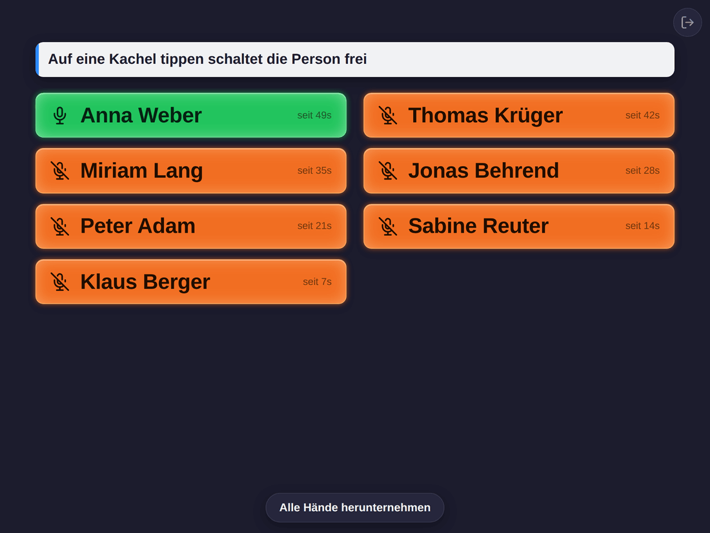
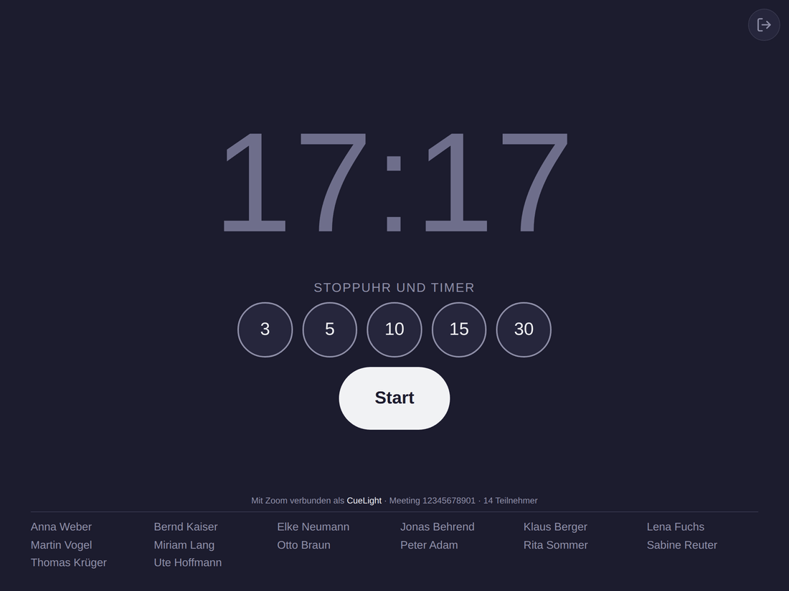
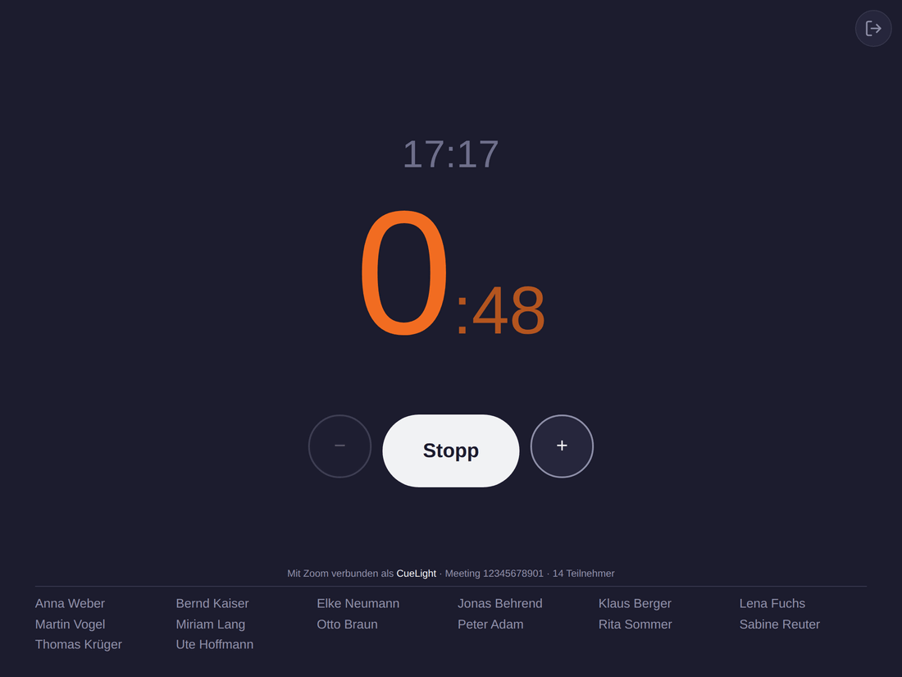

<p align="center">
  
</p>

# CueLight

[](https://github.com/derbredi/cuelight/actions/workflows/publish.yml)

**Hebt jemand in Zoom die Hand, steht sein Name groß vor dir. Dazwischen ist
derselbe Bildschirm deine Uhr.**

<p align="center">
  
</p>

<p align="center"><sub><b>Orange</b>: hat sich gemeldet. <b>Grün</b>: Mikrofon offen, kann sprechen. Wer zuerst dran war, steht oben.</sub></p>

Während eines Programmpunkts hast du den Saal im Blick und sollst
gleichzeitig mitbekommen, wenn sich jemand über Zoom zu Wort meldet.
Das kleine gelbe Handzeichen in der Teilnehmerliste sieht man nur, wenn
man direkt hinschaut. CueLight zeigt jede gehobene Hand als große Kachel
mit dem Namen – auffällig genug, dass man sie aus dem Augenwinkel sieht.
Neben jedem Namen läuft mit, wie lange die Hand schon oben ist; du rufst
also in der richtigen Reihenfolge auf, ohne dir etwas merken zu müssen.

Und du rufst nicht nur auf: **Ein Tippen auf die Kachel schaltet das
Mikrofon frei.** Die Person kann sofort sprechen, ohne dass jemand ein
Zeichen zur Technik geben muss.

## Die meiste Zeit ist es deine Uhr

Meldungen kommen selten, die Uhrzeit brauchst du ständig. Deshalb zeigt
dasselbe Gerät sie groß an, solange nichts los ist – darunter Stoppuhr und
Timer für jeden Programmpunkt, und ganz unten, wer im Meeting ist. Ein
grüner Punkt steht für ein offenes Mikrofon.

<p align="center">
  
</p>

**Die Zahlen sind Minuten** – tippst du auf 10, läuft die Zeit von zehn
Minuten rückwärts. **Start** zählt stattdessen hoch, ohne Ende.
In der letzten Minute wird die Anzeige orange, bei
null zählt sie den Überzug hoch, und eine Minute später räumt sie sich
selbst weg – damit der nächste Redner nicht die Zeit des vorherigen
vorfindet.

<p align="center">
  
</p>

Wenn auch Publikum auf den Bildschirm schauen kann, blendet `?namen=0` am
Ende der Adresse die Namen aus; `?namen=1` schaltet sie wieder ein.

## Was du brauchst

- **Einen Rechner mit Docker**, der während der Veranstaltung läuft. Ein
  Raspberry Pi oder ein NAS reicht.
- **Eine Adresse mit `https://`.** Ohne Verschlüsselung lässt Zoom keinen
  Beitritt zu. CueLight verschlüsselt nicht selbst – das übernimmt etwas,
  das davor sitzt: ein **Cloudflare Tunnel** (keine offenen Ports, bringt
  das Zertifikat mit) oder ein **Reverse-Proxy** wie Caddy, bei dem es zwei
  Zeilen sind:
  ```
  cuelight.deine-domain.de {
      reverse_proxy 127.0.0.1:4000
  }
  ```
  Zum ersten Ausprobieren geht es auf dem Server selbst auch ohne:
  `http://localhost:4000` gilt dem Browser als sicher.
- **Ein Zoom-Konto**, unter dem die Meetings stattfinden.
- **Ein Anzeigegerät** mit aktuellem Browser – ein Tablet ist das
  Naheliegende, ein alter Laptop tut es auch.

CueLight tritt dem Meeting als eigener, stummer Teilnehmer bei. Auf dem
Rechner, der das Meeting hostet, muss nichts installiert werden.

## Einrichten

### 1. Zoom-App anlegen

Einmalig, kostenlos, fünf Minuten. Mit dem Zoom-Konto anmelden, unter dem
die Meetings laufen – CueLight kann nur Meetings dieses Kontos beitreten.

1. Auf [marketplace.zoom.us](https://marketplace.zoom.us) anmelden.
2. **Develop → Build App → General App** anlegen.
3. Unter **Features → Embed** das **Meeting SDK** einschalten.
4. Unter **App Credentials** stehen **Client ID** und **Client Secret**.

Das war es. Keine Scopes, keine Redirect-URL, keine Freigabe – solange
die Meetings in demselben Zoom-Konto laufen, in dem du diese App anlegst.
Zoom sagt das selbst: Für den Beitritt zu einem Meeting *„within the app
owner's account"* genügt die Signatur, die CueLight aus Client ID und
Secret bildet. Veröffentlicht werden muss die App nicht.

> **Meetings aus einem fremden Zoom-Konto?** Dann braucht es zusätzlich
> eine Freigabe über OAuth – *und* eine Prüfung der App durch Zoom, die
> Wochen dauert und begründet werden will. Der Weg ist in
> [OAuth für fremde Konten](#oauth-für-fremde-konten-der-seltene-fall)
> beschrieben. Für den Normalfall – eine Versammlung, ein Zoom-Konto –
> überspring ihn.

### 2. CueLight starten

```bash
mkdir cuelight && cd cuelight
curl -O https://raw.githubusercontent.com/derbredi/cuelight/main/docker-compose.yml
curl -O https://raw.githubusercontent.com/derbredi/cuelight/main/.env.example
cp .env.example .env
nano .env                 # Client ID und Client Secret eintragen
docker compose up -d
```

Die Zugangsdaten stehen in der `.env`, nicht in der `docker-compose.yml` –
so lässt sich die Stack-Datei später durch eine neuere ersetzen, ohne dass
die eigenen Werte verloren gehen. Fehlt eine Pflichtangabe, bricht
`docker compose up` sofort mit einem Hinweis ab, statt einen Container zu
starten, der erst beim Beitritt scheitert.

**Mit Portainer:** *Stacks → Add stack*, den Inhalt der
`docker-compose.yml` einfügen, unter *Environment variables* dieselben
Namen wie in der `.env.example` eintragen, *Deploy*.

**Läuft `cloudflared` selbst als Container** – etwa im selben Docker wie
meldungen.app –, dann ist `localhost:4000` aus seiner Sicht der
Tunnel-Container und nicht der Rechner; Cloudflare meldet dann 502. In
dem Fall CueLight in das Netz des Tunnels hängen:

```bash
docker compose -f docker-compose.yml -f docker-compose.tunnel.yml up -d
```

mit `TUNNEL_NETZ` in der `.env` (der Name des Docker-Netzes, in dem der
Tunnel steht). In Portainer stattdessen die beiden Blöcke aus
`docker-compose.tunnel.yml` in den Stack übernehmen. Als Public Hostname
im Zero-Trust-Dashboard steht dann `cuelight:4000` – der Containername,
kein `localhost`.

**Mehrere Instanzen** – etwa je Saal oder je Zoom-Konto – sind je ein
eigener Stack mit eigener `.env`: `CUELIGHT_NAME` gibt dem Container
seinen Namen (und damit dem Tunnel sein Ziel, `saal2:4000`), jede
Instanz bekommt ihren eigenen `data/`-Ordner und damit ihre eigene
Zoom-Freigabe. Client ID und Secret können alle teilen; bei Zoom muss nur
jede Adresse als Redirect URL stehen, eine je Zeile.

**Läuft alles?** `docker compose logs cuelight | head -20` – ganz oben
steht eine Selbstprüfung, die in ganzen Sätzen sagt, was noch fehlt.
`[FEHLT]` muss erledigt werden, `[Hinweis]` ist eine Entscheidung, kein
Fehler.

### 3. Beitreten

Auf dem Anzeigegerät die Adresse öffnen – vollständig mit `https://`
davor –, die Meeting-ID eintragen und auf **Beitreten** tippen. Mehr ist
es nicht; CueLight tritt still als Teilnehmer bei.

Meeting-ID, Kenncode und Anzeigename merkt sich CueLight auf dem Gerät.
Legst du die Seite auf den Startbildschirm, ist sie beim nächsten
Antippen sofort wieder im Meeting. Der **Lesezeichen-Link** im Aufklapper
enthält dafür kein Passwort; der Kenncode bleibt auf dem Gerät.

Probier das vorab aus – mit dem Gerät und der Adresse, die später wirklich
zum Einsatz kommen, nicht erst am Veranstaltungstag.

## Bedienen

- **Kachel antippen** schaltet die Person frei. Dafür braucht CueLight im
  Meeting Host- oder Co-Host-Rechte – die gibst du ihm in der
  Zoom-Teilnehmerliste wie jedem anderen auch.
- **Alle Hände herunternehmen** steht unter der letzten Kachel.
- **Verlassen** ist der Knopf oben rechts. Danach bleibt CueLight im
  Formular, bis du wieder selbst beitrittst.

## Aus dem Internet erreichbar? Dann absichern

Wer CueLight öffnen kann, kann damit deinem Meeting beitreten. Läuft es
unter einer öffentlichen Adresse, gehört ein Riegel davor: Trag in der
`.env` bei `CUELIGHT_PASSWORD` ein Passwort ein und starte neu. Beim
ersten Aufruf fragt CueLight einmal danach und merkt sich die Anmeldung
ein Jahr lang. Hast du schon eine Zugriffskontrolle – Cloudflare Access,
Proxy mit Passwort, VPN –, lass das Feld leer.

## Betrieb

| Aufgabe | Befehl |
|---|---|
| Aktualisieren | Fassungsnummer in der `docker-compose.yml` anpassen, dann `docker compose pull && docker compose up -d` |
| Stoppen | `docker compose down` |
| Protokoll | `docker compose logs -f` |

Die `docker-compose.yml` nennt eine **feste Fassung** und kein `latest`:
Vor einer Veranstaltung soll nichts ungefragt eine neue Version unter das
Gerät schieben. Welche Fassungen es gibt, steht unter
[Releases](https://github.com/derbredi/cuelight/releases); welche läuft,
klein unten im Einrichtungsformular. Nach einem Neustart des Servers
startet CueLight von selbst wieder.

**Backup:** `docker-compose.yml`, `.env` und der Ordner `data/`. In
`data/` liegt der Zoom-Zugang – das Backup ist so schützenswert wie ein
Passwort.

## Wenn etwas nicht klappt

- **Der Beitritt schlägt fehl.** Gehört das Meeting zu demselben
  Zoom-Konto, unter dem die App angelegt ist? Fremde Konten lässt Zoom
  nicht zu.
- **Es hängt beim Verbinden.** Steht `https://` in der Adresszeile? Ohne
  Verschlüsselung fehlen dem Browser Funktionen, die Zoom braucht. Nach
  zehn Sekunden erscheint **Abbrechen** und bringt dich zurück ins
  Formular. Passiert auf einem Gerät gar nichts, öffne dort
  `zoom.us/wc/join` und tritt einem beliebigen Meeting bei – dieselbe
  Technik. Klappt das auch nicht, ist das Gerät zu alt.
- **Freischalten geht nicht.** Dann hat CueLight im Meeting keine Host-
  oder Co-Host-Rechte.
- **Etwas anderes klemmt.** Die Seite mit `?debug=1` öffnen: Dann zeigt
  CueLight Fehler direkt auf dem Bildschirm, auch auf einem Tablet ohne
  Rechner. Damit bitte ein Issue aufmachen.
- **Die Meetings laufen jetzt in einem anderen Zoom-Konto.** Dann gehört
  die App in dieses Konto: dort eine neue anlegen (Schritt 1) und die
  neuen Werte in die `.env`. Eine bereits erteilte OAuth-Freigabe räumt
  **Freigabe zurücksetzen** im Aufklapper weg.

## OAuth für fremde Konten – der seltene Fall

**Überspring diesen Abschnitt**, wenn die Meetings in demselben
Zoom-Konto laufen, in dem du die App angelegt hast. Das ist der
Normalfall, und dann ist hier nichts zu tun.

Soll CueLight einem Meeting beitreten, das einem **anderen** Zoom-Konto
gehört, verlangt Zoom zweierlei – und beides, nicht nur eines davon:

1. Eine **Prüfung der App durch Zoom**. Eine unveröffentlichte App kommt
   in fremde Meetings gar nicht hinein.
2. Seit dem 2. März 2026 zusätzlich einen **OBF-Token**. Den holt sich
   CueLight über OAuth, und dafür braucht die Zoom-App:
   - unter **Scopes** beide Einträge – einer allein genügt nicht:
     `user:read:user` (damit CueLight prüfen kann, wer freigibt; fehlt er,
     bricht die Freigabe mit *„Zoom-Konto konnte nicht überprüft werden"*
     ab) und `user:read:token` (der Token selbst);
   - als **Redirect-URL** deine Adresse mit `/oauth/callback` am Ende:
     `https://deine-domain.de/oauth/callback`.

   Danach im Aufklapper unter dem Formular auf **Bei Zoom freigeben** –
   mit dem Konto anmelden, dem die Meetings gehören.

Weil Schritt 1 an Zoom hängt und nicht an dir, ist das kein Weg, den man
mal eben geht. Für eine Versammlung mit einem Zoom-Konto ist er auch
nicht nötig.

Die vollständige Beleglage – welcher Token wofür da ist, was Zoom
dokumentiert und was ausdrücklich *nicht* belegt ist – steht in
[docs/recherche-zoom-beitritt-ohne-oauth.md](docs/recherche-zoom-beitritt-ohne-oauth.md).

## Mitmachen

Fehler gefunden oder eine Idee? Gerne ein Issue oder einen Pull Request.
Sicherheitslücken bitte nicht öffentlich, sondern wie in
[SECURITY.md](SECURITY.md) beschrieben.

Wer am Code etwas ändern möchte: Repo klonen, in der `docker-compose.yml`
`image:` durch `build: .` ersetzen, `docker compose up -d --build`. Bei
jedem Push laufen die Tests, und ein Messlauf nimmt die Oberfläche in
allen Zuständen und Bildschirmgrößen auf – die Bilder oben stammen daraus.

## Lizenz

[MIT](LICENSE) – frei nutzbar, auch kommerziell, ohne Gewähr.
