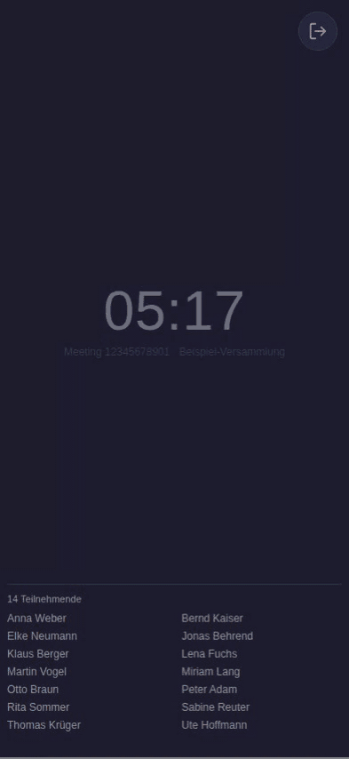

<p align="center">
  
</p>

# CueLight für Zoom

[](https://github.com/derbredi/cuelight/actions/workflows/publish.yml)

**Wortmeldungen aus einem Zoom-Meeting, groß genug, um sie aus dem
Augenwinkel zu sehen.**

Wer vor Publikum spricht und nebenbei Zuhörer aus Zoom dazunehmen will,
hat ein Problem: Das kleine gelbe Handzeichen in der Teilnehmerliste sieht
man nur, wenn man direkt hinschaut. CueLight zeigt stattdessen auf einem
Tablet oder Bildschirm jede gehobene Hand als große, blinkende Kachel mit
dem Namen – auffällig genug, dass man sie mitten im Satz bemerkt.

Ein Tipp auf eine Kachel schaltet die Person frei, sodass sie sofort
sprechen kann.

<p align="center">
  
</p>

## Was du brauchst

- **Einen Rechner mit Docker**, der während der Veranstaltung läuft. Ein
  Raspberry Pi oder ein NAS reicht völlig.
- **Eine Adresse mit `https://`.** Ohne Verschlüsselung lässt Zoom keinen
  Beitritt zu – das gilt für jedes Gerät, auch für ein nagelneues. Der
  nächste Abschnitt zeigt, wie du dazu kommst.
- **Ein Zoom-Konto**, unter dem die Meetings stattfinden.
- **Ein Anzeigegerät** mit einem einigermaßen aktuellen Browser: Tablet,
  Laptop oder ein Bildschirm am Rechner. Zoom unterstützt die aktuelle
  Browser-Version und zwei vorherige. Ob ein älteres Gerät noch mitmacht,
  klärt der Test unter „Wenn etwas nicht klappt".

CueLight tritt dem Meeting als eigener, stummer Teilnehmer bei. Auf dem
Rechner, der das Meeting hostet, muss nichts installiert werden.

## Eine Adresse mit https einrichten

CueLight verschlüsselt nicht selbst – das übernimmt etwas, das davor
sitzt. Zwei verbreitete Wege:

- **Cloudflare Tunnel** (`cloudflared`): Braucht keine offenen Ports am
  Router und bringt das Zertifikat mit. Zu Hause meist der bequemste Weg.
- **Ein Reverse-Proxy** wie Caddy, nginx Proxy Manager oder Traefik mit
  einem Zertifikat von Let's Encrypt. Bei Caddy sind es zwei Zeilen im
  `Caddyfile`, das Zertifikat besorgt er sich selbst:

  ```
  cuelight.deine-domain.de {
      reverse_proxy 127.0.0.1:4000
  }
  ```

Beide Wege setzen eine eigene Domain voraus. Zum ersten Ausprobieren geht
es auch ohne: Direkt auf dem Server selbst funktioniert
`http://localhost:4000`, weil der Browser die eigene Maschine als sicher
behandelt.

## Einrichten

### 1. Zoom-App anlegen

Einmalig, kostenlos, dauert fünf Minuten. Melde dich dafür mit dem
Zoom-Konto an, unter dem die Meetings später laufen – CueLight kann nur
Meetings dieses Kontos beitreten.

1. Auf [marketplace.zoom.us](https://marketplace.zoom.us) anmelden.
2. **Develop → Build App → General App** anlegen.
3. Unter **Features → Embed** das **Meeting SDK** einschalten.
4. Unter **Scopes** den Eintrag `user:read:token` hinzufügen.
5. Als **Redirect-URL** die Adresse eintragen, unter der CueLight später
   erreichbar ist, mit `/oauth/callback` am Ende:
   `https://deine-domain.de/oauth/callback`.
6. Unter **App Credentials** stehen **Client ID** und **Client Secret**.
   Diese beiden Werte brauchst du gleich.

Die App muss nicht veröffentlicht werden.

### 2. CueLight starten

```bash
mkdir cuelight && cd cuelight
curl -O https://raw.githubusercontent.com/derbredi/cuelight/main/docker-compose.yml
nano docker-compose.yml   # Client ID und Client Secret eintragen
docker compose up -d
```

Mit **Portainer** geht es genauso: *Stacks → Add stack*, den Inhalt der
`docker-compose.yml` einfügen, die beiden Werte eintragen, *Deploy*.

Mehr als diese zwei Werte gibt es nicht einzustellen. Ob alles läuft,
zeigt `docker compose logs -f`.

### 3. Loslegen

Öffne auf dem Anzeigegerät deine Adresse – am besten vollständig mit
`https://` davor, weil manche Geräte sonst bei einer unverschlüsselten
Verbindung bleiben. Dann die Meeting-Nummer eintragen und auf **CueLight
starten** tippen.

Beim allerersten Mal erscheint ein blauer Knopf, der dich zu Zoom
schickt. Dort meldest du dich mit dem Konto an, das die Meetings hostet,
und gibst CueLight einmal frei. Das gilt danach dauerhaft.

Probier das einmal vorab aus – mit dem Gerät und der Adresse, die später
wirklich zum Einsatz kommen, und nicht erst am Veranstaltungstag.

## Bedienen

- **Kachel antippen** schaltet die Person frei. Dafür braucht CueLight im
  Meeting Host- oder Co-Host-Rechte – die gibst du ihm in der
  Zoom-Teilnehmerliste wie jedem anderen auch.
- **Alle Hände herunternehmen** erscheint unter der letzten Kachel.
- **Verlassen** ist der Knopf oben rechts. Danach bleibt CueLight im
  Formular stehen, bis du wieder selbst startest.
- Unter welchem Namen CueLight im Meeting auftaucht, legst du im Feld
  **Name im Meeting** fest. Bleibt es leer, heißt es „CueLight".
- Meeting-Nummer, Passwort und Name merkt sich CueLight auf dem Gerät.
  Legst du die Seite auf den Startbildschirm, ist sie beim nächsten
  Antippen sofort wieder im Meeting.
- Quer gehaltene Geräte zeigen die Meldungen nebeneinander in zwei
  Spalten.

### Wenn sich niemand meldet

Dann zeigt CueLight die Uhrzeit und wer im Meeting ist – in derselben
Reihenfolge wie Zoom selbst: Host, Co-Hosts, offene Mikrofone, danach
alphabetisch. Ein grüner Punkt markiert ein offenes Mikrofon, so siehst du
auch jemanden, der spricht, ohne die Hand gehoben zu haben. Sobald sich
jemand meldet, verschwindet die Ansicht.

### Redezeit

Unter der Uhrzeit steht eine Reihe Knöpfe: Eine **Zahl** startet einen
Countdown über so viele Minuten, **Start** zählt einfach hoch. Ein Tipp
genügt, und er startet immer von vorn — auch wenn schon etwas läuft.

Während die Zeit läuft, stehen dort nur noch die Zeit und **Stopp**. In der
letzten Minute wird die Anzeige orange, bei null zählt sie den Überzug
hoch (`+0:20`), und eine Minute später räumt sie sich selbst weg — damit
der nächste Redner nicht die Zeit des vorherigen vorfindet.

Stehen Wortmeldungen an, erscheint die Zeit klein oben links. Dort ist sie
nur Anzeige; bedient wird sie im Ruhezustand.

Wenn auch Publikum auf den Bildschirm schauen kann, blendet `?namen=0` am
Ende der Adresse die Namen aus. CueLight merkt sich das; `?namen=1`
schaltet sie wieder ein. Die Teilnehmerzahl bleibt in beiden Fällen
stehen.

## Aus dem Internet erreichbar? Dann absichern

Wer CueLight öffnen kann, kann damit deinem Zoom-Meeting beitreten. Sobald
es also unter einer öffentlichen Adresse läuft, gehört ein Riegel davor.

**Der einfache Weg:** Trag in der `docker-compose.yml` bei
`CUELIGHT_PASSWORD` ein Passwort ein und starte den Container neu. Beim
ersten Aufruf fragt CueLight einmal danach und merkt sich die Anmeldung
ein Jahr lang.

**Hast du schon eine Zugriffskontrolle** – Cloudflare Access, einen
Reverse-Proxy mit Passwortschutz oder ein VPN –, dann lass
`CUELIGHT_PASSWORD` leer. Zweimal anmelden muss sich niemand.

## Betrieb

| Aufgabe | Befehl |
|---|---|
| Aktualisieren | `docker compose pull && docker compose up -d` |
| Stoppen | `docker compose down` |
| Protokoll ansehen | `docker compose logs -f` |

Nach einem Neustart des Servers startet CueLight von selbst wieder mit.

**Auf eine ältere Fassung zurück:** In der `docker-compose.yml` statt
`:latest` eine feste Version eintragen, etwa
`ghcr.io/derbredi/cuelight:1.2.5`, dann `docker compose up -d`. Alle
Versionen bleiben dauerhaft verfügbar. Welche gerade läuft, steht klein
unten im Einrichtungsformular. Vor einer wichtigen Veranstaltung lohnt es
sich, die getestete Version festzunageln statt `:latest` zu ziehen.

**Backup:** Es genügt, die `docker-compose.yml` und den Ordner `data/` zu
sichern. Beachte dabei: In `data/` liegt der Zoom-Zugang – das Backup ist
also so schützenswert wie ein Passwort.

## Wenn etwas nicht klappt

**Der Beitritt schlägt fehl.** Gehört das Meeting zu demselben Zoom-Konto,
unter dem du die App angelegt hast? Meetings fremder Konten lässt Zoom
nicht zu.

**Der Beitritt hängt und bricht dann ab.** Steht in der Adresszeile
`https://`? Ohne Verschlüsselung fehlen dem Browser Funktionen, die Zoom
zwingend braucht. Ältere Geräte wechseln nicht von selbst, dort also die
Adresse vollständig eintippen. Passiert auf einem Gerät gar nichts, öffne
dort `zoom.us/wc/join` und tritt einem beliebigen Meeting bei – das
benutzt dieselbe Technik. Klappt das auch nicht, ist das Gerät zu alt.

**Freischalten funktioniert nicht.** Dann hat CueLight im Meeting keine
Host- oder Co-Host-Rechte.

**Gehobene Hände tauchen nicht auf, oder etwas anderes klemmt.** Öffne die
Seite mit `?debug=1` am Ende der Adresse: Dann zeigt CueLight
Fehlermeldungen direkt auf dem Bildschirm an – auch auf einem Tablet, ohne
Anschluss an einen Rechner – und schreibt mit, was Zoom über die
Teilnehmer liefert. Damit bitte ein Issue aufmachen.

**Anderes Zoom-Konto nötig?** Im Einrichtungsformular unter
„Lesezeichen-Link und Zoom-Freigabe" gibt es **Freigabe zurücksetzen**. Danach kann ein
anderes Konto freigeben. Gehört die Zoom-App selbst zu einem anderen
Konto, brauchst du dort eine neue App (Schritt 1) und neue Werte in der
`docker-compose.yml` – Zoom-Apps lassen sich nicht umziehen.

## Mitmachen

Fehler gefunden oder eine Idee? Gerne ein Issue oder einen Pull Request
öffnen. Sicherheitslücken bitte nicht öffentlich, sondern wie in
[SECURITY.md](SECURITY.md) beschrieben melden.

Wer am Code etwas ändern möchte: Repo klonen, in der `docker-compose.yml`
`image:` durch `build: .` ersetzen und mit `docker compose up -d --build`
bauen.

Das Bild oben ist eine echte Aufnahme der laufenden Anwendung. Nach einer
Änderung an der Oberfläche lässt es sich neu erzeugen:

```bash
npm install --no-save playwright && npx playwright install chromium
node tools/screenshots.js
```

## Lizenz

[MIT](LICENSE) – frei nutzbar, auch kommerziell, ohne Gewähr.
